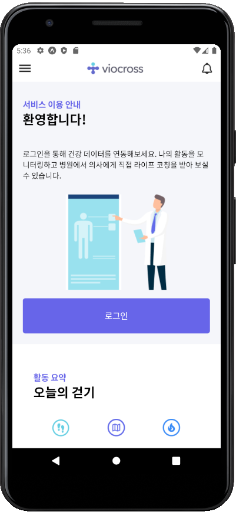
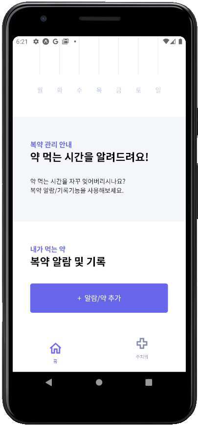

# Cellimedi 


- 씨젠 의료사업 서비스을 구현하는 하이브리드 앱
# Objective
- 씨젠 의료사업 모바일 App의 프로토타입 개발
# 시연 영상

# 개발 환경
- visual Studio Code 2021(version 1.58)
- Expo Framework 4.8.1
- React Native
- Android Studio 4.2.2

# 작업 수행방법

 1. Node 12 LTS이상 [설치](https://nodejs.org/en/)

 2. Dependency Install
 ```
  npm install -g expo-cli
```
3. Expo 시작
```
expo start
```
4. Debug
    - 그래픽 인터페이스인 Expo Dev Tools가 나타남
    - Expo Dev Tools의 좌측 하단, Run in web browser클릭 -> browser로 결과 확인
    - Expo Dev Tools의 좌측 하단, Run on Android device/emulator클릭 -> 연결된 안드로이드 모바일기기로 결과 확인
    
# 당면한 Issue
- 안드로이드 스튜디오를 활용하여 랜딩할때, html내의 컨텐츠들이 모바일 화면보다 크면 expo실행이 강제 종료됨
- Topnavigator구현시, 클릭이벤트가 발생한 버튼의 색이 풀려버리는 에러발생. 
  문제원인: stack navigation의 원리를 이해하지 못해 발생한 것임. stack navigation안의 screen은 각각 state를 독립적으로 관리함. 따라서, navigation.navigate()로 화면 전환을 한 경우, 매개변수를 
           설정하지 않으면 state가 유지되지 않는다.
  해결방법: 독립적인 코드작성# cellimedi_landing-project
